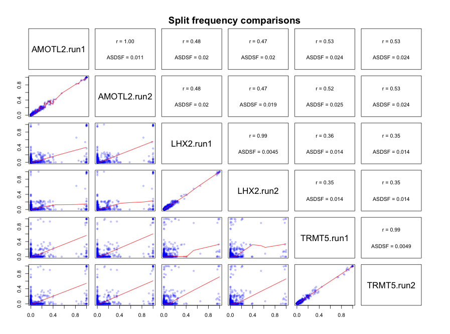

RWTY: R We There Yet?
======================
This package implements various tests, visualizations, and metrics for diagnosing convergence and mixing of MCMC chains in phylogenetics. It implements and automates many of the functions of the AWTY package in the R environment. It also adds a number of new functions not available in AWTY.

-----

# Installation

At present, RWTY is downloadable from https://github.com/danlwarren/RWTY.  There are multiple ways to download it.  The easiest is to use devtools and install from GitHub.

### Installing from GitHub using devtools
Run the following code from your R console:

```{r eval=FALSE}
install.packages("devtools")
library(devtools)
install_github("danlwarren/RWTY")
library(rwty)
```

### Install from zip file

A zipped version of the package is available at https://github.com/danlwarren/RWTY/archive/master.zip.  To install from the zip file, download a copy of it to your system.  Once it's finished downloading, type the following (where PATH is the path to the zip file):

```{r eval=FALSE}
install.packages("devtools")
library(devtools)
install_local("PATH")
library(rwty)
```

-----

### Setting the number of cores

Some of the calculations RWTY performs benefit from the availability of multiple processor cores.  To set the number of cores used by RWTY, all you need to do is assign a global variable called "rwty.processors".  

```{r eval=FALSE}
rwty.processors <<- 8
```

If no rwty.processors object exists in the global environment, RWTY will default to using N-1 cores, where N is the total number available on your system. Due to the limits of R's internal parallelization, this functionality is not available on Windows computers.  

-----

# Interacting with RWTY
RWTY works with lists of rwty.chain objects. Each rwty.chain object contains outputs from a single Bayesian phylogenetic MCMC analysis, e.g. from BEAST or MrBayes. A rwty.chain object must contain the tree topologies from the chain (e.g. from the .t file from MrBayes), and can optionally contain the continuous parameters as well (e.g. from the .p file from MrBayes). A list of rwty.chain objects should all come from analyses of the same taxa. Most often, a list of rwty.chain objects will contain multiple independent replicates of a single MCMC analysis, but it could also contain independent MCMC analyses of different loci from the same set of taxa, or a combination of both (e.g. 4 replicate analyses of 3 different loci).

A lot of analyses in RWTY can be done using just three RWTY functions: ```load.trees()```, ```load.multi()```, and ```analyze.rwty()```. Other functions you might use are any of the functions that start with ```makeplot.```, and the ```topological.approx.ess()``` function.


### ```load.trees()```
This function is used to load in a single MCMC chain, where PATH representing the path to the tree file.  It will load the tree file and attempt find an associated log file, with the type determined by the "format" command.  The default format is for MrBayes, where tree files have a ".t" extension and log files have a ".p" extension.  For example, if your tree file is named "mytrees.t", RWTY will try to find "mytrees.p" in the same directory, and will insert the file into the trees object automatically if it's found.  RWTY can also automatically find files for BEAST and *BEAST runs, so long as you provide the appropriate format command.

If you have a large number of trees and RWTY is taking too long to produce plots, you can subsample your trees with the "trim" command.  For instance, "trim = 10" means RWTY will only keep every tenth tree for analysis

```{r eval=FALSE}
my.trees <- load.trees("PATH")

my.beast.trees <- load.trees("PATH", format = "beast", trim = 5)

my.starbeast.trees <- load.trees("PATH", format = "*beast")
```

If your trees or log files are named or formatted in a nonstandard way, you can still load your data into an RWTY object.  The "logfile" argument takes a path to your logfile, the "type" argument tells RWTY whether your trees are Nexus or Newick format, the "skip" argument tells RWTY how many lines to skip in the log file before it reaches the header line, and the "gens.per.tree" argument tells RWTY how many generations there were in the MCMC inbetween each tree that was sampled.

```{r eval=FALSE}
my.trees <- load.trees("path_to_tree_file", type = "nexus", logfile = "path_to_log_file", skip = 1, gens.per.tree = 1)
```

For example, if you have a collection of trees in Newick format like this:

```
((A, B),(C, D));
(((A, B), C), D);
((A, C),(B, D));
```
and no logfile, you could load them into RWTY like this (note you'd need to change the file path to suit your machine):

```{r eval=FALSE}
my.trees <- load.trees("~/Desktop/trees.phy", type = "newick", gens.per.tree = 1)
```


### ```load.multi()```
This function is used to load more than one chain into a list of rwty.chains objects. It allows you to specify the format of your MCMC analysis, so that it can automatically find tree and log files. You provide a path to the folder containing the tree files, as well as the file format (default is MrBayes). As with load.trees, load.multi will attempt to automatically find log files. For example, to search a directory named PATH for output of a MrBayes run, you would input the following:

```{r eval=FALSE}
my.trees <- load.multi("PATH", format = "mb")
```

### ```analyze.rwty()```
This function conducts a suite of analyses that are applicable to the data that are passed to it. The output from this function will depend on whether you have loaded data from one or more than one chain, and on whether your data comprises just phylogenetic trees, or whether it also includes continuous parameters from log files. Since RWTY runs can take a while, and since a single RWTY run produces a number of plots and metrics, it's a good idea to always store them in an object for later use.

```analyze.rwty()``` will set sensible defaults for most parameters, but you should set the ``burnin``` and the ```fill.color``` to values that are appropriate for your data. The ```burnin``` should be set to a value that removes trees and parameters not sampled from the stationary distribution, and the ```fill.color``` should be set to the name of the parameter from your log file with which you would like to colour the points in tree space. 

```analyze.rwty()``` returns a long list of plots.

```{r results='hide', fig.keep='none', eval=FALSE, message=FALSE, warning=FALSE}
data(salamanders)
salamanders.rwty <- analyze.rwty(salamanders, burnin=50, fill.color = 'LnL')

# to see which plots you have
names(salamanders.rwty)
```

### ```makeplot.x()```
Each of the functions that starts with ```makeplot.``` has a similar set of inputs. Each plot takes a list of one or more ```rwty.chain``` objects and the burnin as input, with other parameters that are specific to certain plots. These functions are useful to tune the parameters of particular plots (e.g. the burnin, or the number of points to plot in tree space plots), which can then be passed to a more thorough analysis through the additional arguments in ```analyze.rwty()```. 

For example, you might choose your burnin based on looking at traces of parameters and trees.

```{r results='hide', fig.keep='none', eval=FALSE, message=FALSE, warning=FALSE}
makeplot.all.params(salamanders, burnin=0) # the LnL trace suggests burnin should be >0

makeplot.all.params(salamanders, burnin=50) # this looks OK
```


### ```topological.approx.ess()```
This function calculates the approximate ESS of tree topologies from all of the chains. It returns a data frame with approximate ESS values, which can be used to decide if the chain has been run for long enough for sufficient samples to be collected. The approximate ESS is mathematically similar to the ESS used for continuous parameters, but in certain cases an upper bound will be provided rather than a point estimate. These are represented by '<', and '=' in the 'operator' column of the data frame respectively.

```{r eval=FALSE}
approx.ess <- topological.approx.ess(salamanders, burnin = 50)
```

Which gives you a data frame that looks like this:

```
  operator approx.ess       chain
1        =   243.0683 AMOTL2.run1
2        =   134.2827 AMOTL2.run2
3        =   222.0624   LHX2.run1
4        =   251.0000   LHX2.run2
5        =   251.0000  TRMT5.run1
6        =   251.0000  TRMT5.run2

```


-----

# RWTY outputs
RWTY outputs a number of useful plots for exploring the performance of MCMC chains. 

### Parameter trace plots
If a logfile is provided, RWTY will produce a trace plot of the value of each column in the log file as a function of position in the chain. If you have multiple chains, the plots will be faceted by chain (you can turn this off using ```facet = FALSE``` when calling ```analyze.rwty()```. The title of each plot shows the Effective Sample Size (ESS) of the parameter. In general, you should aim to have ESS > 200 for all parameters. 

```{r eval=FALSE, fig.width=8, fig.height=6}
salamanders.rwty$pi.C
```


### Parameter correlation plots
If a logfile is provided, RWTY will produce a scatter plot matrix from the columns of the log file, along with the topological distance from the starting tree. Because the log file output of many MCMC programs can contain a large number of columns, the default behavior of makeplot.pairs is to only plot the topological distance along with the first two data columns.  In the density plots on the diagonal, red values indicate values outside the 95% CI.  In the scatter plots in the lower left, brighter and more yellow colors indicate samples from later in the chain.

```{r eval=FALSE, fig.width=8, fig.height=6}
salamanders.rwty$AMOTL2.run1.correlations
```


If you would like to view correlations between likelihood, topology, and model parameters, you can do so by passing a vector of parameter names or "all" to the params argument of makeplot.pairs or analyze.rwty.

```{r eval=FALSE, fig.width=8, fig.height=6}
data(fungus)
plotparams <- c("LnL", "pi.A.", "pi.T.")
makeplot.pairs(fungus$Fungus.Run1, burnin = 20, params = plotparams)
```


### Tree topology trace plot
RWTY will produce a plot of tree topologies that is similar to those for parameters. In these plots, the y-axis represents the distance of each tree in the chain from the last tree of the burnin of the first chain. These plots can reveal whether the MCMC was sampling from a stationary distribution of chains (in which case it should be relative stable) or whether it is moving between modes (in which case you might see large jumps). They can also show how well the chain is mixing with respect to tree topologies. Well mixed chains will show the topology trace jumping rapidly between values. Poorly mixed chains will show chains remaining at similar values in successive samples. Topology traces can also reveal whether different chains are sampling different bits of tree space, in which case the stationary distrubtions will show traces at different y values on the plot. Finally, the topology trace contains an estimate of the ESS (called the approximate ESS) of tree topologies. Note that this estimate is only useful if the trees are sampled from a stationary distribution.

```{r eval=FALSE, fig.width=8, fig.height=6}
salamanders.rwty$topology.trace
```


### Autocorrelation plots
These plots demonstrate the change in average tree distance between trees at different sampling intervals. A well-mixed chain (in which sequential samples of tree topologies are effectively independent) will show flat lines on these plots. In a chain that is mixing poorly with respect to tree topologies, you will see the plot rising to an asymptote. This reflects the fact that are close to each other in the chain are more similar than trees that are further away, otherwise known as autocorrelation.

```{r eval=FALSE, fig.width=8, fig.height=6}
salamanders.rwty$autocorr.plot
```


### Treespace plots
These plots demonstrate the movement of the chain in two dimensional representations of treespace.  The tree space is based on an NMDS scaling of the distances between trees, much like TreeSetViz.  The space is created using all chains together, so the treespaces represented for different chains are comparable. If all chains are sampling similar tree topolgoies, then the treespace plots will look similar for both chains. In this case, we can see that independent runs of the same gene are sampling from similar regions of tree space. But that chains from different genes are sampling from different regions of treespace.

```{r eval=FALSE, fig.width=8, fig.height=6}
salamanders.rwty$treespace.heatmap
salamanders.rwty$treespace.points.plot
```


Since the salamanders data comes from different genes, and those genes are obviously sampling different bits of tree space, it might be more informative to compare the replicate runs of each gene individually.

```{r eval=FALSE, fig.width=8, fig.height=6}
salamanders.treespace = makeplot.treespace(salamanders[1:2], burnin = 50, n.points = 200, fill.color = "LnL")

salamanders.treespace$treespace.heatmap
salamanders.treespace$treespace.points.plot
```


This shows that the replicate analyses of the same gene are sampling very similar parts of treespace.

### Sliding window and cumulative split frequency plots
These plots show the split frequencies of clades in the chain, either as the frequency within a sliding window or as the frequency calculated from cumulative samples in the chain at various points in analysis. By default they show the 20 clades with the highest standard deviation of split frequencies within each sample (e.g. the standard deviation of the split frequencies of a given clade in a given chain, across all sliding windows). In an analysis that is mixing well, we expect the frequencies in the sliding window to move around a lot, but the frequencies in the cumulative plot should level off. If the frequencies in the cumulative plot have not levelled off, it might be necessary to run the chain for longer.  Plots can be produced for single chains, or for multiple chains.


```{r eval=FALSE, fig.width=8, fig.height=6}
salamanders.rwty$splitfreqs.sliding.plot
salamanders.rwty$splitfreqs.cumulative.plot
```


For a single chain:
```{r eval=FALSE, fig.width=8, fig.height=6}
makeplot.splitfreqs.cumulative(salamanders[[1]])
makeplot.splitfreqs.sliding(salamanders[[1]])
```


### Sliding window and cumulative average change in split frequency (ACSF) plots
These plots show the change in split frequencies of clades in the chain, either as the frequency within a sliding window or as the frequency calculated from cumulative samples in the chain at various points in the analysis. They are analagous to the previous two plots, but instead of showing split frequencies of clades on the y axis, they show the change in split frequencies of all clades on the y axis. The solid line is the average change in split frequencies (ACSF), and the ribbons show the 100%, 95%, and 75% quantiles of the Change in Split Frequencies (CSF). Ideally, we'd see the sliding window change in split frequencies remaining above zero but without big jumps (which would indicate the chain being stuck in one region of tree space, then moving to another), and we'd see the cumulative change in split frequencies approaching zero (indicating that the chain has settled on sampling from a single reqion of tree space, and that adding additional samples is not making any appreciable difference to the estimates of clade posterior probabilities one might make from the analysis).

```{r eval=FALSE, fig.width=8, fig.height=6}
salamanders.rwty$acsf.sliding.plot
salamanders.rwty$acsf.cumulative.plot
```


-----

## Multiple chains only
The following plots are only produced with analyze.rwty() is passed list of rwty.chain object that contains more than one chain.

### Average Standard Deviation of Split Frequency (ASDSF) plot
This plot shows the ASDSF of all clades that appear in any of the chains, calculated from cumulative samples in the chain at various points in the analysis. The solid line shows the ASDSF, and the ribbons show the 75%, 95%, and 100% quantiles of the Standard Deviation of Split Frequencies (SDSF) across clades. I.e. the upper line of the grey ribbon shows the clade with the 87.5% highest SDSF between chains, and the lower line of the grey ribbon shows the clade with the 12.5% highest SDSF. Each generation in the plot represents the distribution of SDSFs if the chains were all stopped at that point. The lower the ASDSF, the more the chains agree on split frequencies. In general we expect the SDSF to get lower as the chains progress, and to eventually reach an asymptote at some low value once all the chains have been sampling from a stationary distribution for a long time. Because we are usually intersted in the right-hand end of this graph, where the ASDSF values can be much lower than at the start of the chain, the y axis is plotted on a log10 scale. 

Note that the points and line represent the mean, not the median, SDSF.  For this reason it is possible for the line to fall outside of the inner ribbons with the distribution of SDSFs is highly skewed.

```{r eval=FALSE, fig.width=8, fig.height=6}
makeplot.asdsf(salamanders[c(1,2)])
```


### Split frequency scatterplot matrix
These plots are another way of visualizing the agreement or disagreement between the regions of tree space that chains have sampled. For each pair of chains, the cumulative final frequency of each clade (which is also our best estimate of that clade's posterior probability) is plotted against ts frequency in another chain in the lower triangle, and the the correlation (Pearson's R) and ASDSF of each pair of chains is shown in the upper triangle.

```{r eval=FALSE, fig.width=8, fig.height=6}
salamanders.rwty$splitfreq.matrix
```



### ASDSF tree 
This plot shows the similarity of split frequencies between chains. Chains with the most similar split frequencies be clustered together in the tree. This plot can quickly reveal which chains are sampling similar and different regions of tree space.

```{r eval=FALSE, fig.width=8, fig.height=6}
salamanders.rwty$asdsf.tree
```
